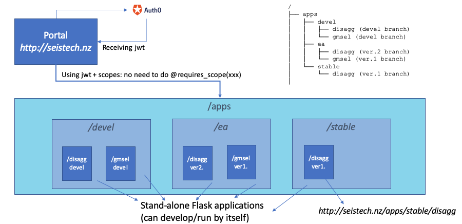

# Auth0FlaskPortal
Auth0-integrated Flask Portal that hosts child Flask applications with implicit Auth0 support

# Introduction

Auth0 (www.auth0.com) is a commercial Authentication SaaS (Software-as-a-service). Auth0FlaskPortal integrates Auth0 and its Authorization Extension to support multiple levels of access control during the Flask-based website development stages allowing the Flask web-app developer to focus on the core function without worrying about the security or business logic.

# What this can do
1. Hosting multiple Flask-based web applications via dispatching by a path on the URL.
2. Depending on the location of the child Flask application code (eg. `/apps/stable`, `/apps/ea/`, `/apps/devel/`), access to each application is protected by the global Auth0 setup without adding extra code or a decorator to the endpoints.
3. Supports Websocket (https://flask-socketio.readthedocs.io/en/latest/)
4. Automatically detects all the available child Flask apps and adds to the Application Dispatcher (http://flask.pocoo.org/docs/0.12/patterns/appdispatch) based on Werkzeug middleware (https://werkzeug.palletsprojects.com/en/0.15.x/middleware/dispatcher/ ) (Note: Minimal code change to the Flask app is needed. See below)
5. Through Auth0 Authorization Extension's Group hierarchy feature, a user with higher access-level can access applications requiring lower access-level.
6. Extends Auth0's basic User DB and can mange extra User info in a separate DB

# Architecture
Child Flask applications are placed under `/apps/{devel,ea,stable}`.


# Setting up a child Flask application
1. Place the code under `/apps/{devel,ea,stable}/` depending on the maturity of the code. Let's assume the application name is `APP` which is in Early adopter testing stage. Your code will be located at `/apps/ea/APP`
2. Make sure there is `__init__.py` under `/apps/ea/APP` which exposes the Flask app object and all its routes. If  the Flask object and routes are all defined in `__init__.py`, no change is needed. Otherwise, import them into `__init__.py`. Suppose there are created in `APP/web/app.py` and `APP/web/routes.py`, your `__init__.py` should look like below.
```
from .web.app import sfapp
from .web.routes import *
```
3. Go to the part of your code where Flask object is created (eg. `APP/web/app.py`), and change the line 

```
sfapp = Flask(__name__)
```
to

```
from authflask import AuthFlask
sfapp = AuthFlask(__name__)
```
`authflask` is a part of this project, so you may need to update your `PYTHONPATH` to be able to import it. `AuthFlask` is a subclass of the original Flask with an overriding route() method with added security check.

4. That's it. You will need to update `PYTHONPATH` in `runserver.sh` to make it understand your app's importing requirements. Restart the Auth0FlaskPortal by running `runserver.sh` to run your Flask application.

5. Visit the URL of your Flask application. Assuming the root URL is `http://localhost:3000`, your Flask application should be accessible via `http://localhost:3000/apps/ea/APP`. Go to the main page and get authenticated first. You will need to have a user account with `ea` permission or higher. 

# Setting up the global Auth0 configuration
You need to create a .env file that looks like
```
AUTH0_CLIENT_ID=5F4dR32kKqGFF6065DaDhYUKLxwqJD4D
AUTH0_DOMAIN=seistech.auth0.com
AUTH0_CLIENT_SECRET=XLJKe56sFLJH4FLSZKcpfDG94DwdLhXBc8LKWwgNdZtLnBssGYMasdFasfgaHaS2
AUTH0_CALLBACK_URL=http://localhost:3000/callback
AUTH0_AUDIENCE=http://seistech.nz/api
SECRET_KEY=<your random secret key for Flask Session>
MYSQL_USERNAME=<your mysql username>
MYSQL_PASSWORD=<your mysql password>
MYSQL_IP=<your mysql IP address>
MYSQL_DB=<your mysql db name>
```

All AUTH0... properties can be obtained from your Auth0 Dashboard>Applications>"your application"
 
